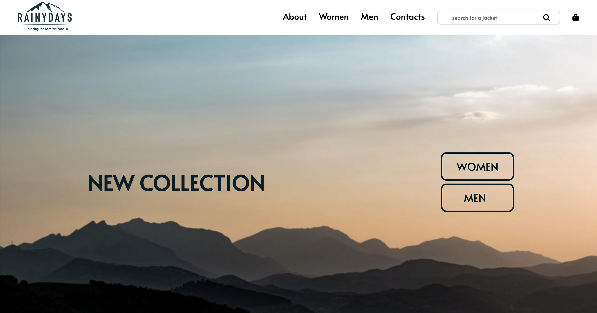

# Rainydays

</img>

An e-commerce website for a fictitional outdoor clothing vendor as a course assignment for HTML and CSS Module, Front-End Development at Noroff.

## Description

The project comprises two parts, firstly prototyping in Figma and secondarily building a static website using HTML and CSS. 

The logo and product images were supplied by [Noroff](https://www.noroff.no/). However, the product images were replaced by content from [Unsplash](https://unsplash.com/). The reason for doing this was that I believed that the website would look better having images of models wearing the products in an outdoor setting.

All the icons are taken form [Fontawesome](https://fontawesome.com/).

## Website

[Rainydays website](https://peppy-froyo-40c9b0.netlify.app)

## Figma Project

[Rainydays Figma prototype](https://www.figma.com/file/OQeqxc9BeesBryScP1gLL5/Design1_FP?node-id=3%3A9)

Description
Add a more detailed description of what your project entails and set out to do.

You can add some bullet points if you'd like to:

List item 1
List item 2
List item 3
Built With
You can list a the tech stack that you've used over here

React.js
Bootstrap
Getting Started
Installing
This is where you list how to get the project started. It typically just includes telling a person to clone the repo and then to install the dependencies e.g.

Clone the repo:
git clone git@github.com:NoroffFEU/portfolio-1-example.git
Install the dependencies:
npm install
Running
Here is where you detail how to run the app. It typically involves the commands you'd need to run to start the project e.g.

To run the app, run the following commands:

npm run start
Contributing
Here you can detail any information you want to provide regarding contributing to the project. For big projects you will usually have a separate CONTRIBUTING.md and link to it, but for smaller projects you can simply include instructions here. These instructions can simply detail the process you want a person to take, such as to make sure to open a pull request so code can be reviewed.

Contact
This is where you can leave your social links for people to contact you, such as a LinkedIn profile or Twitter link e.g.

My Twitter page

My LinkedIn page

License
You can link to your license file here if you're using one, or mention what license the codebase falls under. If you're unsure then you can simply delete this section.

Acknowledgments
This is where you can add any acknowledgements if you'd like, such as to people who have helped you or any code snippets you'd like to mention. You can delete this section if you don't have any acknowledgements to make.
